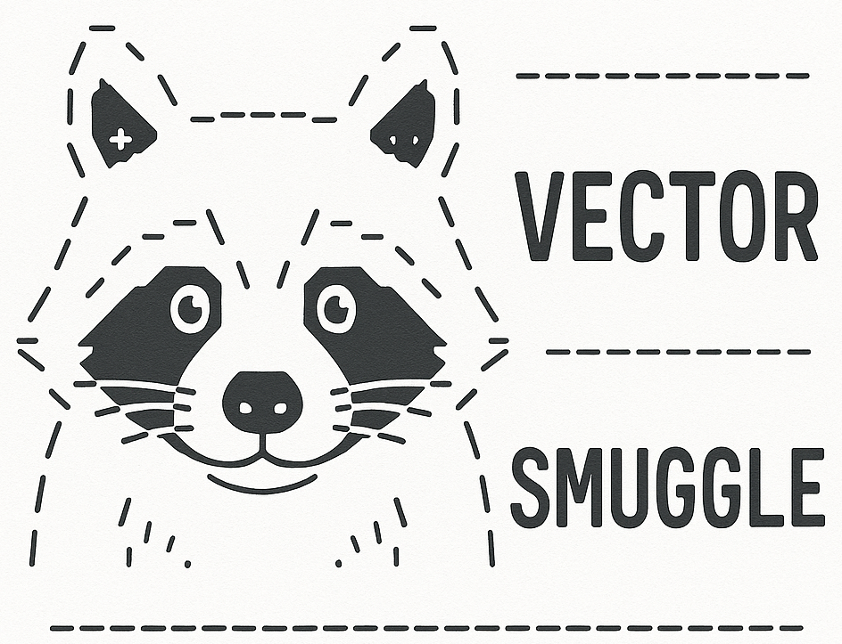
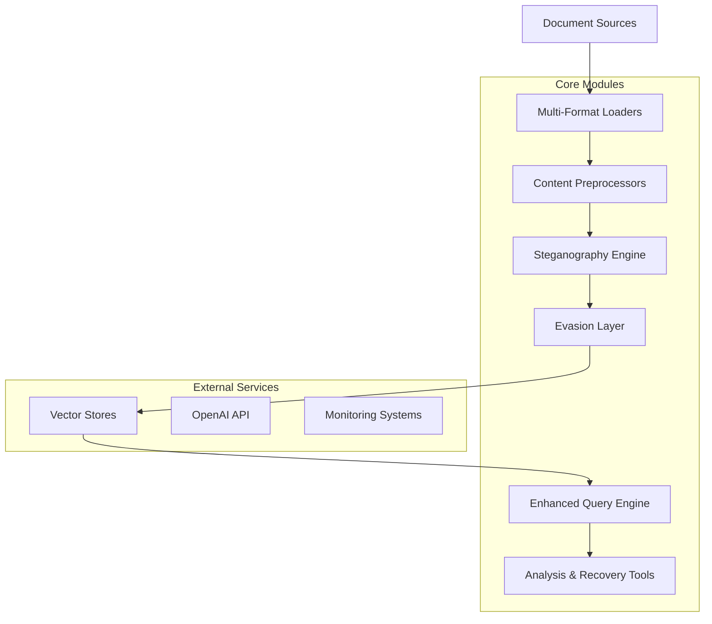

# VectorSmuggle

_"The smuggle is real!"_

A comprehensive proof-of-concept demonstrating vector-based data exfiltration techniques in AI/ML environments. This project illustrates potential risks in RAG systems and provides tools and concepts for defensive analysis.

> **⚠️ EXPERIMENTAL RESEARCH PROJECT**: This is an educational proof-of-concept that has not undergone peer review or formal validation. Performance claims, if any, should be considered preliminary and require independent verification through rigorous experimental methodology.

[](https://opensource.org/licenses/MIT)
[](https://www.python.org/downloads/)
[](https://github.com/jaschadub/VectorSmuggle)
[](https://github.com/jaschadub/VectorSmuggle)

## 📋 Overview

VectorSmuggle demonstrates techniques for covert data exfiltration through vector embeddings, showcasing how sensitive information can be hidden within seemingly legitimate RAG operations. This research tool helps security professionals understand and defend against attack vectors in AI/ML systems.

### Key Features

- **🎭 Steganographic Techniques**: Embedding obfuscation and data hiding
- **📄 Multi-Format Support**: Process 15+ document formats (PDF, Office, email, databases)
- **🕵️ Evasion Capabilities**: Behavioral camouflage and detection avoidance
- **🔍 Enhanced Query Engine**: Data reconstruction and analysis
- **🐳 Production-Ready**: Full containerization and Kubernetes deployment
- **📊 Analysis Tools**: Comprehensive forensic and risk assessment capabilities

## 🏗️ Architecture



## 🚀 Quick Start

### Prerequisites

- Python 3.11+
- OpenAI API key (or Ollama with nomic-embed-text:latest as fallback)
- Docker (optional)
- Kubernetes cluster (optional)

### Installation

```bash
# Clone repository
git clone https://github.com/jaschadub/VectorSmuggle.git
cd VectorSmuggle

# Set up virtual environment
python3 -m venv .venv
source .venv/bin/activate

# Install dependencies
pip install -r requirements.txt

# Configure environment
cp .env.example .env
# Edit .env with your API keys and settings
```

### Basic Usage

```bash
# Embed documents with steganographic techniques
cd scripts
python embed.py --files ../sample_docs/*.pdf --techniques noise,rotation,fragmentation

# Query and reconstruct data
python query.py --mode recovery --export results.json

# Generate risk assessment
cd ../analysis
python risk_assessment.py
```

## 📚 Documentation

### Research Documentation
- [📖 Research Methodology](docs/research_methodology.md) - Research approach and validation
- [⚔️ Attack Vectors](docs/attack_vectors.md) - Comprehensive attack analysis
- [🛡️ Defense Strategies](docs/defense_strategies.md) - Countermeasures and detection
- [⚖️ Compliance Impact](docs/compliance_impact.md) - Regulatory implications

### Technical Documentation
- [🏗️ System Architecture](docs/technical/architecture.md) - Design and components
- [📋 API Reference](docs/technical/api_reference.md) - Module documentation
- [⚙️ Configuration Guide](docs/technical/configuration.md) - Setup and options
- [🔧 Troubleshooting](docs/technical/troubleshooting.md) - Common issues

### Usage Guides
- [🚀 Quick Start Guide](docs/guides/quick_start.md) - Getting started
- [🎯 Advanced Usage](docs/guides/advanced_usage.md) - Complex scenarios
- [🔒 Security Testing](docs/guides/security_testing.md) - Testing procedures
- [🚢 Deployment Guide](docs/guides/deployment.md) - Production deployment

## 🔧 Core Components

### Steganographic Engine
Advanced techniques for hiding data within vector embeddings:

```python
from steganography import EmbeddingObfuscator, MultiModelFragmenter

# Apply noise-based steganography
obfuscator = EmbeddingObfuscator(noise_level=0.01)
hidden_embeddings = obfuscator.obfuscate(embeddings, techniques=["noise", "rotation"])

# Fragment across multiple models
fragmenter = MultiModelFragmenter()
fragments = fragmenter.fragment_and_embed(sensitive_data)
```

### Multi-Format Document Processing
Support for diverse document types:

```python
from loaders import DocumentLoaderFactory

factory = DocumentLoaderFactory()
documents = factory.load_documents([
    "financial_report.pdf",
    "employee_data.xlsx", 
    "emails.mbox",
    "database_export.sqlite"
])
```

### Evasion Capabilities
Sophisticated detection avoidance:

```python
from evasion import BehavioralCamouflage, TrafficMimicry

# Simulate legitimate user behavior
camouflage = BehavioralCamouflage(legitimate_ratio=0.8)
camouflage.generate_cover_story("data analysis project")

# Mimic normal traffic patterns
mimicry = TrafficMimicry(base_interval=300.0)
await mimicry.execute_with_timing(upload_operation)
```

### Enhanced Query Engine
Advanced data reconstruction:

```python
from query import AdvancedQueryEngine, DataRecoveryTools

engine = AdvancedQueryEngine(vector_store, llm, embeddings)
recovery = DataRecoveryTools(embeddings)

# Multi-strategy search and reconstruction
results = engine.multi_strategy_search("sensitive financial data")
reconstructed = recovery.recover_data(results)
```

## 🔍 Analysis Tools

### Risk Assessment
Comprehensive security risk evaluation:

```python
from analysis.risk_assessment import VectorExfiltrationRiskAssessor

assessor = VectorExfiltrationRiskAssessor()
assessment = assessor.perform_comprehensive_assessment(
    documents, embeddings, config
)
print(f"Risk Level: {assessment.overall_risk_level}")
```

### Forensic Analysis
Digital forensics for incident investigation:

```python
from analysis.forensic_tools import EvidenceCollector, TimelineReconstructor

collector = EvidenceCollector()
evidence = collector.collect_vector_store_evidence(vector_data)

reconstructor = TimelineReconstructor()
timeline = reconstructor.reconstruct_timeline(evidence)
```

### Detection Signatures
Generate security detection rules:

```python
from analysis.detection_signatures import StatisticalSignatureGenerator

generator = StatisticalSignatureGenerator()
generator.establish_baseline(clean_embeddings)
signatures = generator.generate_statistical_signatures()
```

### Baseline Generation
Create legitimate traffic patterns:

```python
from analysis.baseline_generator import BaselineDatasetGenerator

generator = BaselineDatasetGenerator()
dataset = generator.generate_baseline_dataset(
    num_users=50, days=7
)
```

## 🐳 Deployment

### Docker Deployment

```bash
# Development environment
docker-compose -f docker-compose.yml -f docker-compose.dev.yml up -d

# Production environment
docker-compose -f docker-compose.yml -f docker-compose.prod.yml up -d
```

### Kubernetes Deployment

```bash
# Deploy to Kubernetes
kubectl apply -f k8s/ -n vectorsmuggle

# Check deployment status
kubectl get pods -n vectorsmuggle
kubectl rollout status deployment/vectorsmuggle -n vectorsmuggle
```

### Automated Deployment

```bash
# Full deployment with monitoring
./scripts/deploy/deploy.sh --environment production --platform kubernetes --build

# Health check and validation
./scripts/deploy/health-check.sh --detailed --export health-report.json
```

## ⚙️ Configuration

### Environment Variables

```bash
# Core settings
OPENAI_API_KEY=sk-...
VECTOR_DB=qdrant
CHUNK_SIZE=512

# Embedding fallback settings
OLLAMA_BASE_URL=http://localhost:11434
OLLAMA_EMBEDDING_MODEL=nomic-embed-text:latest

# Steganography settings
STEGO_ENABLED=true
STEGO_TECHNIQUES=noise,rotation,fragmentation
STEGO_NOISE_LEVEL=0.01

# Evasion settings
EVASION_TRAFFIC_MIMICRY=true
EVASION_BEHAVIORAL_CAMOUFLAGE=true
EVASION_LEGITIMATE_RATIO=0.8

# Query settings
QUERY_CACHE_ENABLED=true
QUERY_MULTI_STEP_REASONING=true
QUERY_CONTEXT_RECONSTRUCTION=true
```

### Embedding Model Fallback

VectorSmuggle includes automatic fallback support for embedding models:

1. **Primary**: OpenAI embeddings (requires API key)
2. **Fallback**: Ollama with nomic-embed-text:latest (local)

#### Setting up Ollama Fallback

```bash
# Install Ollama
curl -fsSL https://ollama.ai/install.sh | sh

# Pull the embedding model
ollama pull nomic-embed-text:latest

# Start Ollama service
ollama serve
```

The system will automatically detect and use the available embedding provider.

### Advanced Configuration

See [`docs/technical/configuration.md`](docs/technical/configuration.md) for comprehensive configuration options.

### Code Quality

```bash
# Run linting and security checks
ruff check .
bandit -r . -f json

# Type checking
mypy .
```

## 🧪 Research Methodology

### Experimental Status
This project represents a proof-of-concept implementation designed for educational and research purposes. The techniques demonstrated require rigorous experimental validation before any performance claims can be substantiated. (**IN-PROGRESS**)

**Metrics Definition:**
- **Capacity**: Measured in bits per embedding dimension with statistical significance testing
- **Detection Resistance**: Defined using specific metrics (ROC-AUC, F1-score) with confidence intervals
- **Fidelity**: Cosine similarity preservation with variance analysis

## ⚠️ Security Risks Demonstrated

- **Covert Data Exfiltration**: Embedding systems can leak sensitive data without detection
- **DLP Bypass**: Traditional Data Loss Prevention tools cannot detect semantic leaks via vectors
- **Insider Threats**: Malicious actors can pose as legitimate LLM/RAG engineers
- **External Storage**: Sensitive data stored in third-party vector databases
- **Steganographic Hiding**: Data concealed within legitimate-looking embeddings
- **Behavioral Camouflage**: Attack activities disguised as normal user behavior

## 🛡️ Defensive Measures

- **Egress Monitoring**: Monitor outbound connections to vector databases
- **Embedding Analysis**: Statistical analysis of vector spaces for anomalies
- **Behavioral Detection**: User activity pattern analysis
- **Content Sanitization**: Remove sensitive information before embedding
- **Access Controls**: Strict permissions and authentication requirements
- **Audit Logging**: Comprehensive logging of all embedding operations

## 🎓 Educational Use Cases

### Security Training
- Red team exercises and attack simulations
- Blue team defense strategy development
- Security awareness training programs
- Incident response scenario planning

### Research Applications
- Academic security research projects
- Vulnerability assessment methodologies
- Defense mechanism development
- Threat modeling frameworks

### Compliance Testing
- Regulatory compliance validation
- Data protection impact assessments
- Security control effectiveness testing
- Risk assessment procedures

## 🤝 Contributing

We welcome contributions from the security research community:

1. **Fork** the repository
2. **Create** a feature branch (`git checkout -b feature/amazing-feature`)
3. **Commit** your changes (`git commit -m 'Add amazing feature'`)
4. **Push** to the branch (`git push origin feature/amazing-feature`)
5. **Open** a Pull Request

### Contribution Guidelines
- Follow the existing code style and conventions
- Add comprehensive tests for new features
- Update documentation for any changes
- Ensure all security checks pass
- Include educational value in contributions

## 📄 License

This project is licensed under the MIT License - see the [LICENSE](LICENSE) file for details.

## ⚖️ Legal Disclaimer

**IMPORTANT: This repository and its contents are intended for educational and ethical security research purposes only.**

- Any actions or activities related to this material are solely your responsibility
- Misuse of these tools or techniques to access unauthorized data is illegal and unethical
- The authors assume no liability for any misuse or damage caused by this material
- **Always obtain proper authorization before performing any security testing**

## 📞 Contact

For questions, suggestions, or responsible disclosure of security issues:

- **General Questions**: Open an issue on GitHub
- **Research Collaboration**: Contact the maintainer

## 📖 Citation

If you use VectorSmuggle in your research, please cite it as follows:

### BibTeX
```bibtex
@software{vectorsmuggle2025,
  title={VectorSmuggle: A Comprehensive Framework for Vector-Based Data Exfiltration Research},
  author={Wanger, Jascha},
  organization={Tarnover, LLC},
  year={2025},
  url={https://github.com/jaschadub/VectorSmuggle},
  note={Educational security research framework for AI/ML systems}
}
```

### APA Style
```
Wanger, J. (2025). VectorSmuggle: A Comprehensive Framework for Vector-Based Data Exfiltration Research [Computer software]. Tarnover, LLC. https://github.com/jaschadub/VectorSmuggle
```

### IEEE Style
```
J. Wanger, "VectorSmuggle: A Comprehensive Framework for Vector-Based Data Exfiltration Research," Tarnover, LLC, 2025. [Online]. Available: https://github.com/jaschadub/VectorSmuggle
```

---

**Remember**: This tool is designed to help improve security through education and research. Use responsibly and ethically.

*Portions of this code are generated, tested, and audited using advanced AI models. [ThirdKey](https://thirdkey.ai) can help secure your AI infrastructure.*
