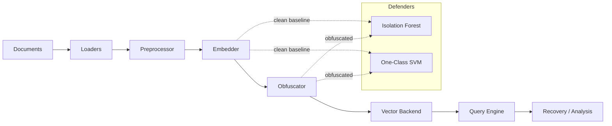

# VectorSmuggle

A research framework demonstrating vector-based data exfiltration techniques in AI/ML environments. This project examines covert data leakage in retrieval-augmented generation (RAG) systems and provides tools for both offensive analysis and defensive countermeasure development.

[](https://colab.research.google.com/github/jaschadub/VectorSmuggle/blob/main/vector_payload_swap_demo_colab.ipynb)
[](https://www.apache.org/licenses/LICENSE-2.0)
[](https://www.python.org/downloads/)
[](https://github.com/jaschadub/VectorSmuggle)
[](https://github.com/jaschadub/VectorSmuggle)
[](https://doi.org/10.5281/zenodo.20058256)

> **Try the demo →** Click the **Open in Colab** badge above to run the Vector-Payload Dissociation demo in your browser — no setup, no API key needed (uses LanceDB + sentence-transformers).

> **Companion preprint:** Wanger, J. (2026). *VectorSmuggle: Steganographic Exfiltration in Embedding Stores and a Cryptographic Provenance Defense*. Zenodo. <https://doi.org/10.5281/zenodo.20058256>
>
> **Constructive defense:** [VectorPin](https://github.com/ThirdKeyAI/VectorPin) — cryptographic provenance for embedding stores, locked to the threat model evaluated here.

## Overview

VectorSmuggle investigates how sensitive information can be hidden within seemingly legitimate vector embeddings, surfacing risks that traditional Data Loss Prevention systems are not designed to detect. The framework supports security researchers, red and blue team exercises, and academic study of attack and defense in AI/ML pipelines.

### Key Capabilities

- **Steganographic techniques**: Embedding obfuscation through noise injection, rotation, scaling, offset, fragmentation, and decoy interleaving
- **Multi-format ingestion**: Support for 15+ document formats (PDF, Office, email, structured data, databases)
- **Multi-backend evaluation**: FAISS Flat / HNSW / PQ, Chroma HNSW, Qdrant float32 and int8 — used for the cross-backend bit-channel survival study
- **Multi-model evaluation**: OpenAI `text-embedding-3-large` plus four local Ollama embedding models exercised in the paper (`nomic-embed-text`, `embeddinggemma`, `snowflake-arctic-embed`, `mxbai-embed-large`); `scripts/multi_model_study.py` runs the full battery, and any other Ollama embedding model (e.g. `bge-large`, `bge-m3`, `granite-embedding`, `arctic-embed-m-v2.0`) can be plugged in by extending the `MODELS` list at the top of that script
- **Detection battery**: Isolation Forest and One-Class SVM detectors used as defenders inside every empirical script
- **Reproducibility**: deterministic per-run seeding and timestamped result directories under `results/`

## Architecture


```mermaid
graph LR
    A[Documents] --> B[Loaders]
    B --> C[Preprocessor]
    C --> D[Embedder]
    D --> E[Obfuscator]
    E --> F[Vector Backend]
    F --> G[Query Engine]
    G --> H[Recovery / Analysis]

    subgraph defenders [Defenders]
        I[Isolation Forest]
        J[One-Class SVM]
    end
    D -.->|clean baseline| I
    D -.->|clean baseline| J
    E -.->|obfuscated| I
    E -.->|obfuscated| J
```

See [`docs/architecture.md`](docs/architecture.md) for the module-by-module description.

## Quick Start

### Prerequisites

- Python 3.11 or later
- OpenAI API key (for the paper's headline numbers) or Ollama with at least one local embedding model
- Docker (optional, for the containerized run path)

### Installation

```bash
git clone https://github.com/jaschadub/VectorSmuggle.git
cd VectorSmuggle

python3 -m venv .venv
source .venv/bin/activate

pip install -r requirements.txt

cp .env.example .env
# Edit .env to provide API keys and runtime settings
```

### Basic Usage

```bash
# Embed documents using steganographic techniques
python scripts/embed.py --files sample_docs/*.pdf --techniques noise,rotation,fragmentation

# Query and reconstruct embedded data
python scripts/query.py --mode recovery --export results.json
```

### Interactive Demonstration

The `examples/quickstart_demo.py` script walks through the complete workflow end to end:

```bash
cd examples
python quickstart_demo.py

# Reproducible run
python quickstart_demo.py --seed 42

# Specific techniques only
python quickstart_demo.py --techniques noise rotation fragmentation
```

The demo covers:

- End-to-end workflow: document loading, steganographic embedding, vector storage, and query reconstruction
- Multiple techniques: noise injection, rotation, scaling, and cross-model fragmentation
- Real sample data from `sample_docs/` (financial, HR, technical files)
- Integrity verification of encoding and decoding
- Performance metrics: processing time, success rate, and data statistics

Expected runtime: 10–30 seconds. Sample output (with the default chunker, `chunk_size=512`, `chunk_overlap=50`): ~10 supported files in `sample_docs/` to ~22 loaded document objects (CSVs split into per-row records) to ~73 text chunks to 73 steganographic embeddings.

See [`examples/README.md`](examples/README.md) for detailed setup instructions, troubleshooting, and expected outputs.

## Documentation

The research narrative — threat model, technique catalog, empirical results, and the VectorPin defense — lives in the preprint at <https://doi.org/10.5281/zenodo.20058256>. The repository documentation covers how to run, configure, and extend the framework.

- [Architecture](docs/architecture.md) — module layout and pipeline
- [Configuration](docs/configuration.md) — environment variables and runtime settings
- [Usage](docs/usage.md) — quick-start, paper reproduction, library use
- [API reference](docs/api_reference.md) — public module APIs
- [Deployment](docs/deployment.md) — running in Docker and bringing up local backends
- [Troubleshooting](docs/troubleshooting.md) — common failure modes

For testing, see [TEST_PLAN.md](TEST_PLAN.md) and [TESTING_GUIDE.md](TESTING_GUIDE.md).

## Library use

The pipeline modules are importable. A typical custom experiment looks like:

```python
from pathlib import Path

import numpy as np
from langchain_openai import OpenAIEmbeddings
from langchain_text_splitters import RecursiveCharacterTextSplitter

from loaders.document_factory import DocumentLoaderFactory
from steganography.obfuscation import EmbeddingObfuscator
from analysis.detectors import IsolationForestDetector
from analysis.detectors.isolation_forest_detector import evaluate

# Load the full sample corpus (~9 docs -> ~68 chunks) used by the paper.
sample_dir = Path("sample_docs")
files = sorted(p for p in sample_dir.iterdir() if p.is_file() and p.name != "README.md")
docs = DocumentLoaderFactory().load_documents([str(f) for f in files])
chunks = RecursiveCharacterTextSplitter(chunk_size=512, chunk_overlap=50).split_documents(docs)

embedder = OpenAIEmbeddings(model="text-embedding-3-large")
clean = np.asarray(embedder.embed_documents([c.page_content for c in chunks]))

obfuscator = EmbeddingObfuscator(seed=42, noise_level=0.01)
rotated, _rotation_matrix = obfuscator.apply_rotation(clean)

# 27/41 train/test split mirrors the headline detection table in the paper.
detector = IsolationForestDetector(n_estimators=200, contamination=0.05).fit(clean[:27])
metrics = evaluate(detector, clean[27:], rotated[27:])
print(metrics["auc"])  # ~0.5 at the obfuscator's library-default rotation parameters
```

See [`docs/api_reference.md`](docs/api_reference.md) for the public module APIs.

## Deployment

VectorSmuggle is a research framework, so "deployment" usually means running the experiments inside a container for reproducibility:

```bash
docker build -t vectorsmuggle:latest .
docker run --rm -e OPENAI_API_KEY=sk-... -v "$PWD/results:/app/results" \
  vectorsmuggle:latest python scripts/empirical_study.py
```

The cross-backend study expects local Qdrant and Chroma; bring them up with:

```bash
cd test_vector_dbs_docker && docker compose up -d
```

See [`docs/deployment.md`](docs/deployment.md) for the full workflow.

## Configuration

The minimum settings to run the empirical study against OpenAI:

```bash
OPENAI_API_KEY=sk-...
OPENAI_EMBEDDING_MODEL=text-embedding-3-large
VECTOR_DB=faiss
CHUNK_SIZE=512
```

For local embedding via Ollama, pull one or more embedding models and run the multi-model study:

```bash
# The four models exercised in the paper:
ollama pull nomic-embed-text
ollama pull embeddinggemma:300m
ollama pull snowflake-arctic-embed:335m
ollama pull mxbai-embed-large:335m

python scripts/multi_model_study.py
```

To evaluate a different Ollama embedding model (`bge-large`, `bge-m3`, `granite-embedding`, `arctic-embed-m-v2.0`, or any other model with an embedding endpoint), `ollama pull` it and add the tag to the `MODELS` list at the top of `scripts/multi_model_study.py`. The same script is also reused as the per-model template by `scripts/multi_corpus_study.py` for cross-corpus runs.

The full set of environment variables — including the steganography intensity parameters used to reproduce specific paper measurements — is documented in [`docs/configuration.md`](docs/configuration.md).

## Testing and Code Quality

```bash
# Install test dependencies
pip install -r requirements-test.txt

# Run the full pytest suite
python -m pytest tests/

# Run a specific suite via the harness
python run_comprehensive_tests.py --suite unit --coverage
python run_comprehensive_tests.py --suite integration
python run_comprehensive_tests.py --suite security
python run_comprehensive_tests.py --suite research

# Linting and security checks
ruff check .
bandit -r . -x ./venv,./tests
```

## Research

The empirical study, threat model, technique catalog, and the constructive defense (VectorPin) are described in the companion preprint at <https://doi.org/10.5281/zenodo.20058256>. The numbers in the paper are produced by the scripts in `scripts/` against the corpus in `sample_docs/`; see [`docs/usage.md`](docs/usage.md) for the reproduction workflow.

Headline findings (v1.2 preprint):

- Distribution-shifting perturbations (noise, scaling, offset, combinations) are often detectable in our corpus by an off-the-shelf Isolation Forest or One-Class SVM trained on a clean baseline.
- Small-angle / few-rotation orthogonal rotation defeats distribution-based detection on every (model, corpus) pair tested — five embedding models (OpenAI `text-embedding-3-large` plus four local Ollama models) and three corpora (the 68-chunk synthetic-PII baseline plus a cross-corpus replication on BEIR NFCorpus and a Quora subset, ~26,000 chunks combined).
- A disjoint-Givens rotation encoder gives a closed-form per-vector capacity ceiling of `floor(d/2) * b` bits — 1,920 B per vector at `d=3072`, `b=10` — with a working encoder/decoder that round-trips arbitrary payloads at zero BER under float64, float32, and float16 storage. The retrieval-preserving operating point at `cos ≥ 0.7` caps the *useful* channel at hundreds of bytes per vector, not the ceiling, and at high `K` the AUC becomes data-distribution-dependent.
- The bit channel survives every non-PQ vector-store configuration we tested (FAISS-flat, FAISS-HNSW, Chroma, Qdrant float32, Qdrant int8). FAISS IVF-PQ is the one configuration that materially narrows the channel — `recover_cos` drops to 0.76–0.88 — as a side effect of memory optimization rather than an intentional defense.
- White-box adaptive attackers drive both detector AUCs to near-zero, confirming that statistical detection is not a load-bearing control.

The constructive defense, VectorPin, signs each embedding to its source content and producing model with Ed25519 over a canonical byte representation. Any post-embedding modification — including all studied techniques — breaks signature verification. See <https://github.com/ThirdKeyAI/VectorPin>.

## Educational use

VectorSmuggle is intended for use in red-team exercises, blue-team detector development, and academic security research. Sample applications include studying how steganographic perturbations interact with deployed RAG defenses, evaluating new detector designs against the technique catalog, and probing how vector backends transform embeddings under quantization.

## Contributing

Contributions are welcome. Open a pull request with a clear description of the change, ensure `ruff check .` and the test suite pass, and update documentation for user-visible behavior changes. For larger changes, open an issue first so we can discuss the approach.

## License

This project is licensed under the Apache License 2.0. See the [LICENSE](LICENSE) file for details.

## Legal Disclaimer

This repository and its contents are intended for educational and ethical security research only.

- Any actions or activities related to this material are solely your responsibility
- Misuse of these tools or techniques to access unauthorized data is illegal and unethical
- The authors assume no liability for any misuse or damage caused by this material
- Always obtain proper authorization before performing any security testing

## Contact

For questions, suggestions, or responsible disclosure of security issues:

- General questions: open an issue on GitHub
- Research collaboration: contact the maintainer

## Citation

If you reference VectorSmuggle in your research, please cite the companion
preprint (which describes the threat model, empirical results, and the
VectorPin defense) and the software framework itself.

### Preprint (preferred)

> Wanger, J. (2026). *VectorSmuggle: Steganographic Exfiltration in Embedding Stores and a Cryptographic Provenance Defense*. Zenodo. <https://doi.org/10.5281/zenodo.20058256>

```bibtex
@misc{wanger2026vectorsmuggle,
  title  = {{VectorSmuggle}: Steganographic Exfiltration in Embedding Stores and a Cryptographic Provenance Defense},
  author = {Wanger, Jascha},
  year   = {2026},
  publisher = {Zenodo},
  doi    = {10.5281/zenodo.20058256},
  url    = {https://doi.org/10.5281/zenodo.20058256}
}
```

### Software framework

```bibtex
@software{vectorsmuggle-framework,
  title  = {{VectorSmuggle}: A research framework for vector-based data exfiltration},
  author = {Wanger, Jascha},
  organization = {Tarnover, LLC},
  year   = {2025},
  url    = {https://github.com/jaschadub/VectorSmuggle},
  note   = {Apache-2.0; companion to \href{https://doi.org/10.5281/zenodo.20058256}{the Zenodo preprint}}
}
```

### APA

```
Wanger, J. (2026). VectorSmuggle: Steganographic exfiltration in embedding stores and a cryptographic provenance defense. Zenodo. https://doi.org/10.5281/zenodo.20058256
```

### IEEE

```
J. Wanger, "VectorSmuggle: Steganographic exfiltration in embedding stores and a cryptographic provenance defense," Zenodo, 2026. [Online]. Available: https://doi.org/10.5281/zenodo.20058256
```

---

This tool is intended to improve security through education and research. Use responsibly and ethically.

*Portions of this code are generated, tested, and audited using advanced AI models. [ThirdKey](https://thirdkey.ai) can help secure your AI infrastructure.*
