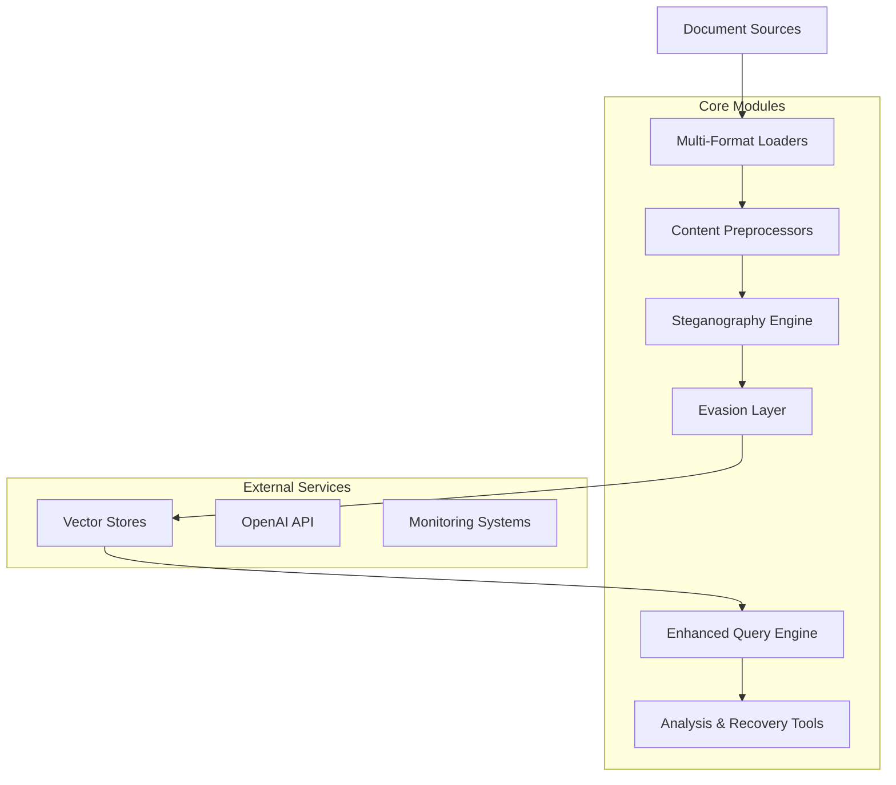

# VectorSmuggle

A research framework demonstrating vector-based data exfiltration techniques in AI/ML environments. This project examines covert data leakage in retrieval-augmented generation (RAG) systems and provides tools for both offensive analysis and defensive countermeasure development.

[](https://www.apache.org/licenses/LICENSE-2.0)
[](https://www.python.org/downloads/)
[](https://github.com/jaschadub/VectorSmuggle)
[](https://github.com/jaschadub/VectorSmuggle)

## Overview

VectorSmuggle investigates how sensitive information can be hidden within seemingly legitimate vector embeddings, surfacing risks that traditional Data Loss Prevention systems are not designed to detect. The framework supports security researchers, red and blue team exercises, and academic study of attack and defense in AI/ML pipelines.

### Key Capabilities

- **Steganographic techniques**: Embedding obfuscation through noise injection, rotation, scaling, offset, fragmentation, and decoy interleaving
- **Multi-format ingestion**: Support for 15+ document formats (PDF, Office, email, structured data, databases)
- **Evasion layer**: Behavioral camouflage, traffic mimicry, and detection avoidance
- **Enhanced query engine**: Multi-strategy retrieval and data reconstruction
- **Containerized deployment**: Docker and Kubernetes manifests for reproducible environments
- **Analysis tooling**: Forensic collection, risk assessment, and detection signature generation

## Architecture


```mermaid
graph TB
    A[Document Sources] --> B[Multi-Format Loaders]
    B --> C[Content Preprocessors]
    C --> D[Steganography Engine]
    D --> E[Evasion Layer]
    E --> F[Vector Stores]
    F --> G[Enhanced Query Engine]
    G --> H[Analysis & Recovery Tools]

    subgraph "Core Modules"
        B
        C
        D
        E
        G
        H
    end

    subgraph "External Services"
        F
        I[OpenAI API]
        J[Monitoring Systems]
    end
```

## Quick Start

### Prerequisites

- Python 3.11 or later
- OpenAI API key (or Ollama with `nomic-embed-text:latest` as a local fallback)
- Docker (optional, for containerized runs)
- Kubernetes cluster (optional, for production-style deployment)

### Installation

```bash
git clone https://github.com/jaschadub/VectorSmuggle.git
cd VectorSmuggle

python3 -m venv .venv
source .venv/bin/activate

pip install -r requirements.txt

cp .env.example .env
# Edit .env to provide API keys and runtime settings
```

### Basic Usage

```bash
# Embed documents using steganographic techniques
python scripts/embed.py --files sample_docs/*.pdf --techniques noise,rotation,fragmentation

# Query and reconstruct embedded data
python scripts/query.py --mode recovery --export results.json
```

### Interactive Demonstration

The `examples/quickstart_demo.py` script walks through the complete workflow end to end:

```bash
cd examples
python quickstart_demo.py

# Reproducible run
python quickstart_demo.py --seed 42

# Specific techniques only
python quickstart_demo.py --techniques noise rotation fragmentation
```

The demo covers:

- End-to-end workflow: document loading, steganographic embedding, vector storage, and query reconstruction
- Multiple techniques: noise injection, rotation, scaling, and cross-model fragmentation
- Real sample data from `sample_docs/` (financial, HR, technical files)
- Integrity verification of encoding and decoding
- Performance metrics: processing time, success rate, and data statistics

Expected runtime: 10–30 seconds. Sample output: 6 documents to 45 chunks to 45 steganographic embeddings.

See [`examples/README.md`](examples/README.md) for detailed setup instructions, troubleshooting, and expected outputs.

## Documentation

### Research

- [Research methodology](docs/research_methodology.md) — research approach and validation
- [Attack vectors](docs/attack_vectors.md) — comprehensive attack analysis
- [Defense strategies](docs/defense_strategies.md) — countermeasures and detection
- [Compliance impact](docs/compliance_impact.md) — regulatory implications
- [Vector-payload dissociation](docs/vector_payload_dissociation.md) — dissociation technique analysis

### Technical

- [System architecture](docs/technical/architecture.md) — design and components
- [API reference](docs/technical/api_reference.md) — module documentation
- [Configuration guide](docs/technical/configuration.md) — setup and options
- [Troubleshooting](docs/technical/troubleshooting.md) — common issues
- [Multi-database architecture](docs/multi_database_effectiveness_architecture.md) — multi-DB testing design

### Usage Guides

- [Quick start](docs/guides/quick_start.md) — getting started
- [Advanced usage](docs/guides/advanced_usage.md) — complex scenarios
- [Security testing](docs/guides/security_testing.md) — testing procedures
- [Deployment](docs/guides/deployment.md) — production deployment
- [Large-scale testing](docs/large_scale_testing.md) — large-scale validation framework
- [Multi-database setup](docs/multi_database_setup.md) — multi-DB testing setup
- [Payload dissociation testing](docs/guides/vector_payload_dissociation_testing.md) — dissociation test guide

### Testing

- [Test plan](TEST_PLAN.md) — testing strategy and coverage targets
- [Testing guide](TESTING_GUIDE.md) — running the test suite

## Core Components

### Steganographic Engine

Techniques for hiding data within vector embeddings:

```python
from steganography import EmbeddingObfuscator, MultiModelFragmenter

# Apply noise-based steganography
obfuscator = EmbeddingObfuscator(noise_level=0.01)
hidden_embeddings = obfuscator.obfuscate(embeddings, techniques=["noise", "rotation"])

# Fragment across multiple models
fragmenter = MultiModelFragmenter()
fragments = fragmenter.fragment_and_embed(sensitive_data)
```

### Multi-Format Document Processing

```python
from loaders import DocumentLoaderFactory

factory = DocumentLoaderFactory()
documents = factory.load_documents([
    "financial_report.pdf",
    "employee_data.xlsx",
    "emails.mbox",
    "database_export.sqlite",
])
```

### Evasion Capabilities

```python
from evasion import BehavioralCamouflage, TrafficMimicry

# Simulate legitimate user behavior
camouflage = BehavioralCamouflage(legitimate_ratio=0.8)
camouflage.generate_cover_story("data analysis project")

# Mimic normal traffic patterns
mimicry = TrafficMimicry(base_interval=300.0)
await mimicry.execute_with_timing(upload_operation)
```

### Enhanced Query Engine

```python
from query import AdvancedQueryEngine, DataRecoveryTools

engine = AdvancedQueryEngine(vector_store, llm, embeddings)
recovery = DataRecoveryTools(embeddings)

# Multi-strategy search and reconstruction
results = engine.multi_strategy_search("sensitive financial data")
reconstructed = recovery.recover_data(results)
```

## Analysis Tools

### Risk Assessment

```python
from analysis.risk_assessment import VectorExfiltrationRiskAssessor

assessor = VectorExfiltrationRiskAssessor()
assessment = assessor.perform_comprehensive_assessment(documents, embeddings, config)
print(f"Risk Level: {assessment.overall_risk_level}")
```

### Forensic Analysis

```python
from analysis.forensic_tools import EvidenceCollector, TimelineReconstructor

collector = EvidenceCollector()
evidence = collector.collect_vector_store_evidence(vector_data)

reconstructor = TimelineReconstructor()
timeline = reconstructor.reconstruct_timeline(evidence)
```

### Detection Signatures

```python
from analysis.detection_signatures import StatisticalSignatureGenerator

generator = StatisticalSignatureGenerator()
generator.establish_baseline(clean_embeddings)
signatures = generator.generate_statistical_signatures()
```

### Baseline Generation

```python
from analysis.baseline_generator import BaselineDatasetGenerator

generator = BaselineDatasetGenerator()
dataset = generator.generate_baseline_dataset(num_users=50, days=7)
```

## Deployment

### Docker

```bash
# Development
docker-compose -f docker-compose.yml -f docker-compose.dev.yml up -d

# Production
docker-compose -f docker-compose.yml -f docker-compose.prod.yml up -d
```

### Kubernetes

```bash
# Deploy
kubectl apply -f k8s/ -n vectorsmuggle

# Verify
kubectl get pods -n vectorsmuggle
kubectl rollout status deployment/vectorsmuggle -n vectorsmuggle
```

### Automated Deployment

```bash
# Full deployment with monitoring
./scripts/deploy/deploy.sh --environment production --platform kubernetes --build

# Health check
./scripts/deploy/health-check.sh --detailed --export health-report.json
```

## Configuration

### Environment Variables

```bash
# Core settings
OPENAI_API_KEY=sk-...
VECTOR_DB=qdrant
CHUNK_SIZE=512

# Embedding fallback settings
OLLAMA_BASE_URL=http://localhost:11434
OLLAMA_EMBEDDING_MODEL=nomic-embed-text:latest

# Steganography settings
STEGO_ENABLED=true
STEGO_TECHNIQUES=noise,rotation,fragmentation
STEGO_NOISE_LEVEL=0.01

# Evasion settings
EVASION_TRAFFIC_MIMICRY=true
EVASION_BEHAVIORAL_CAMOUFLAGE=true
EVASION_LEGITIMATE_RATIO=0.8

# Query settings
QUERY_CACHE_ENABLED=true
QUERY_MULTI_STEP_REASONING=true
QUERY_CONTEXT_RECONSTRUCTION=true
```

### Embedding Model Fallback

VectorSmuggle includes automatic fallback for embedding providers:

1. **Primary**: OpenAI embeddings (requires API key)
2. **Fallback**: Ollama with `nomic-embed-text:latest` (local)

#### Ollama Setup

```bash
# Install Ollama
curl -fsSL https://ollama.ai/install.sh | sh

# Pull the embedding model
ollama pull nomic-embed-text:latest

# Start the Ollama service
ollama serve
```

The system detects and uses the available provider automatically.

### Advanced Configuration

See [`docs/technical/configuration.md`](docs/technical/configuration.md) for the full set of configuration options.

## Testing and Code Quality

```bash
# Install test dependencies
pip install -r requirements-test.txt

# Run the full pytest suite
python -m pytest tests/

# Run a specific suite via the harness
python run_comprehensive_tests.py --suite unit --coverage
python run_comprehensive_tests.py --suite integration
python run_comprehensive_tests.py --suite security
python run_comprehensive_tests.py --suite research

# Linting and security checks
ruff check .
bandit -r . -x ./venv,./tests
```

## Research Methodology

This project is a proof-of-concept implementation intended for educational and research use. The techniques demonstrated require rigorous experimental validation before any quantitative performance claims can be substantiated. (Status: in progress.)

Metric definitions:

- **Capacity**: bits per embedding dimension, with statistical significance testing
- **Detection resistance**: ROC-AUC and F1-score, reported with confidence intervals
- **Fidelity**: cosine similarity preservation with variance analysis

## Security Risks Demonstrated

- **Covert exfiltration**: Embedding pipelines can leak sensitive data without obvious signals
- **DLP bypass**: Traditional Data Loss Prevention tools cannot detect semantic leaks via vectors
- **Insider threats**: Malicious actors can pose as legitimate LLM/RAG engineers
- **External storage**: Sensitive data ends up in third-party vector databases
- **Steganographic hiding**: Data concealed within otherwise legitimate-looking embeddings
- **Behavioral camouflage**: Attack activity disguised as normal user behavior

## Defensive Measures

- **Egress monitoring**: Track outbound connections to vector databases
- **Embedding analysis**: Statistical analysis of vector spaces for anomalies
- **Behavioral detection**: User activity pattern analysis
- **Content sanitization**: Remove sensitive information before embedding
- **Access controls**: Strict permissions and authentication requirements
- **Audit logging**: Comprehensive logging of all embedding operations

## Educational Use Cases

### Security Training

- Red team exercises and attack simulations
- Blue team defense strategy development
- Security awareness training programs
- Incident response scenario planning

### Research Applications

- Academic security research projects
- Vulnerability assessment methodologies
- Defense mechanism development
- Threat modeling frameworks

### Compliance Testing

- Regulatory compliance validation
- Data protection impact assessments
- Security control effectiveness testing
- Risk assessment procedures

## Contributing

Contributions from the security research community are welcome:

1. Fork the repository
2. Create a feature branch (`git checkout -b feature/your-feature`)
3. Commit your changes (`git commit -m 'Add your feature'`)
4. Push to the branch (`git push origin feature/your-feature`)
5. Open a pull request

### Contribution Guidelines

- Follow existing code style and conventions
- Add comprehensive tests for new features
- Update documentation for any user-visible changes
- Ensure all linting and security checks pass
- Prioritize educational value

## License

This project is licensed under the Apache License 2.0. See the [LICENSE](LICENSE) file for details.

## Legal Disclaimer

This repository and its contents are intended for educational and ethical security research only.

- Any actions or activities related to this material are solely your responsibility
- Misuse of these tools or techniques to access unauthorized data is illegal and unethical
- The authors assume no liability for any misuse or damage caused by this material
- Always obtain proper authorization before performing any security testing

## Contact

For questions, suggestions, or responsible disclosure of security issues:

- General questions: open an issue on GitHub
- Research collaboration: contact the maintainer

## Citation

If you use VectorSmuggle in your research, please cite it as follows.

### BibTeX

```bibtex
@software{vectorsmuggle2025,
  title={VectorSmuggle: A Framework for Vector-Based Data Exfiltration Research},
  author={Wanger, Jascha},
  organization={Tarnover, LLC},
  year={2025},
  url={https://github.com/jaschadub/VectorSmuggle},
  note={Educational security research framework for AI/ML systems}
}
```

### APA

```
Wanger, J. (2025). VectorSmuggle: A Framework for Vector-Based Data Exfiltration Research [Computer software]. Tarnover, LLC. https://github.com/jaschadub/VectorSmuggle
```

### IEEE

```
J. Wanger, "VectorSmuggle: A Framework for Vector-Based Data Exfiltration Research," Tarnover, LLC, 2025. [Online]. Available: https://github.com/jaschadub/VectorSmuggle
```

---

This tool is intended to improve security through education and research. Use responsibly and ethically.

*Portions of this code are generated, tested, and audited using advanced AI models. [ThirdKey](https://thirdkey.ai) can help secure your AI infrastructure.*
