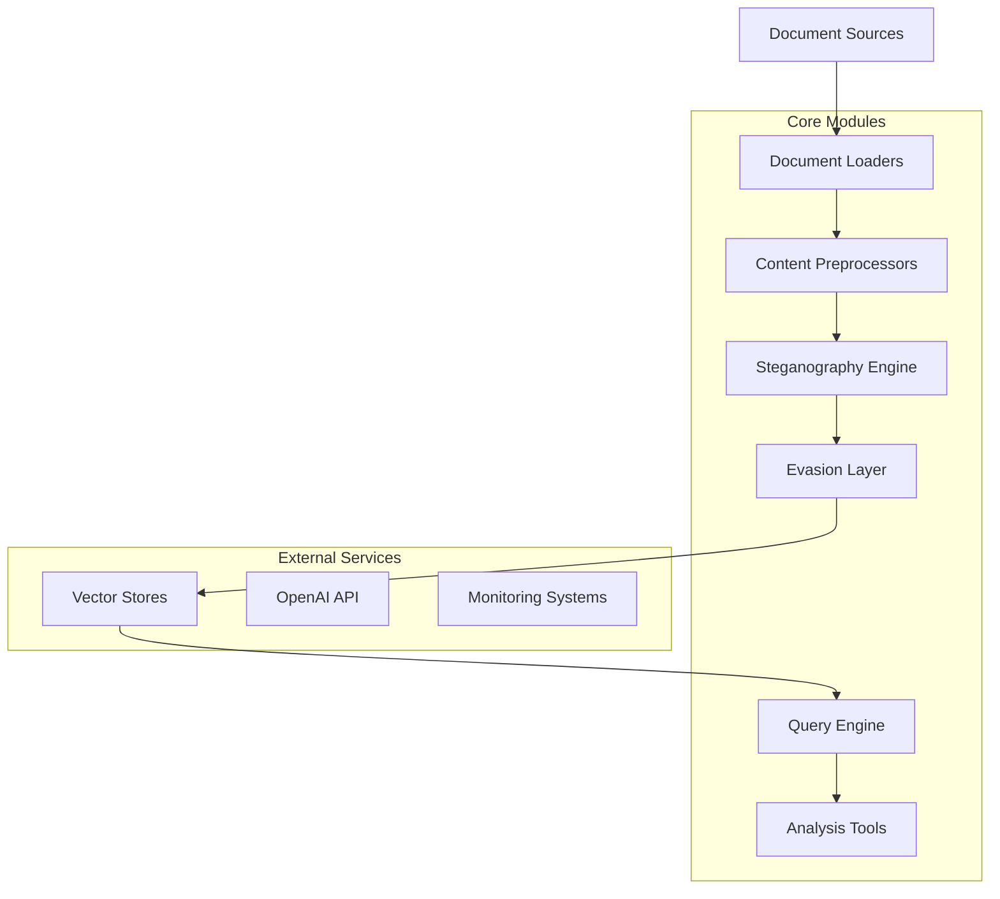
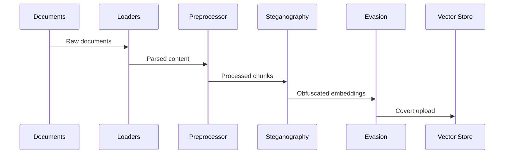
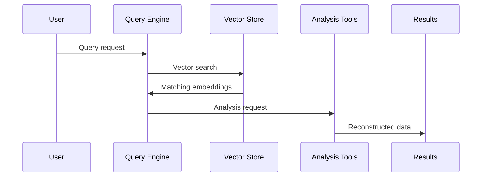

# System Architecture

## Overview

VectorSmuggle implements a modular, extensible architecture designed to demonstrate vector-based data exfiltration techniques while maintaining clean separation of concerns and educational clarity.

## High-Level Architecture



## Core Components

### 1. Document Processing Layer

**Document Loaders (`loaders/`)**
- [`DocumentLoaderFactory`](../../loaders/document_factory.py): Factory pattern for format-specific loaders
- [`OfficeLoader`](../../loaders/office_loader.py): Microsoft Office document processing
- [`StructuredLoader`](../../loaders/structured_loader.py): JSON, XML, YAML processing
- [`EmailLoader`](../../loaders/email_loader.py): Email format processing
- [`DatabaseLoader`](../../loaders/database_loader.py): Database export processing

**Content Preprocessing (`loaders/preprocessors.py`)**
```python
class ContentPreprocessor:
    """Handles content sanitization and preparation."""
    
    def preprocess_documents(self, documents, **options):
        """Apply preprocessing pipeline to documents."""
        # Sanitization, normalization, chunking
        pass
```

### 2. Steganography Engine

**Core Steganographic Techniques (`steganography/`)**
- [`EmbeddingObfuscator`](../../steganography/obfuscation.py): Vector space manipulation
- [`MultiModelFragmenter`](../../steganography/fragmentation.py): Cross-model distribution
- [`TimedExfiltrator`](../../steganography/timing.py): Temporal attack patterns
- [`DecoyGenerator`](../../steganography/decoys.py): Noise and decoy injection

**Architecture Pattern:**
```python
class SteganographyPipeline:
    def __init__(self, config):
        self.obfuscator = EmbeddingObfuscator(config.steganography)
        self.fragmenter = MultiModelFragmenter(config.steganography)
        self.timer = TimedExfiltrator(config.steganography)
        self.decoy_gen = DecoyGenerator(config.steganography)
    
    def apply_techniques(self, embeddings, techniques):
        """Apply selected steganographic techniques."""
        for technique in techniques:
            embeddings = self.technique_map[technique](embeddings)
        return embeddings
```

### 3. Evasion Layer

**Evasion Techniques (`evasion/`)**
- [`TrafficMimicry`](../../evasion/traffic_mimicry.py): Legitimate traffic simulation
- [`BehavioralCamouflage`](../../evasion/behavioral_camouflage.py): User behavior simulation
- [`NetworkEvasion`](../../evasion/network_evasion.py): Network-level evasion
- [`OperationalSecurity`](../../evasion/opsec.py): OPSEC and cleanup
- [`DetectionAvoidance`](../../evasion/detection_avoidance.py): Security control bypass

**Layered Defense Bypass:**
```python
class EvasionOrchestrator:
    def __init__(self, config):
        self.traffic_mimicry = TrafficMimicry(config.evasion)
        self.behavioral = BehavioralCamouflage(config.evasion)
        self.network = NetworkEvasion(config.evasion)
        self.opsec = OperationalSecurity(config.evasion)
        self.detection = DetectionAvoidance(config.evasion)
    
    def execute_with_evasion(self, operation):
        """Execute operation with full evasion stack."""
        with self.opsec.secure_context():
            self.behavioral.simulate_legitimate_activity()
            self.network.apply_evasion_techniques()
            return self.traffic_mimicry.execute_with_timing(operation)
```

### 4. Query and Analysis Engine

**Query Capabilities (`query/`)**
- [`AdvancedQueryEngine`](../../query/advanced_engine.py): Multi-strategy search
- [`ContextReconstructor`](../../query/context_reconstruction.py): Document structure rebuilding
- [`CrossReferenceAnalyzer`](../../query/cross_reference.py): Relationship analysis
- [`QueryOptimizer`](../../query/optimization.py): Performance optimization
- [`DataRecoveryTools`](../../query/recovery_tools.py): Data reconstruction

**Query Architecture:**
```python
class QueryArchitecture:
    def __init__(self, vector_store, llm, embeddings):
        self.engine = AdvancedQueryEngine(vector_store, llm, embeddings)
        self.reconstructor = ContextReconstructor(embeddings)
        self.analyzer = CrossReferenceAnalyzer(embeddings, llm)
        self.optimizer = QueryOptimizer(embeddings)
        self.recovery = DataRecoveryTools(embeddings)
    
    def comprehensive_analysis(self, query):
        """Perform comprehensive data analysis."""
        results = self.engine.multi_strategy_search(query)
        context = self.reconstructor.reconstruct_context(results)
        references = self.analyzer.find_cross_references(results)
        return self.recovery.reconstruct_original_data(results, context, references)
```

## Data Flow Architecture

### 1. Embedding Generation Flow



### 2. Query and Reconstruction Flow



## Configuration Management

### 1. Centralized Configuration

**Configuration Structure (`config.py`):**
```python
@dataclass
class Config:
    """Main configuration class with nested components."""
    openai: OpenAIConfig
    vector_store: VectorStoreConfig
    document: DocumentConfig
    steganography: SteganographyConfig
    evasion: EvasionConfig
    query: QueryConfig
    
    def validate(self) -> None:
        """Validate all configuration settings."""
        pass
```

### 2. Environment-Based Configuration

**Environment Variables:**
```bash
# Core settings
OPENAI_API_KEY=sk-...
VECTOR_DB=qdrant
CHUNK_SIZE=512

# Steganography settings
STEGO_ENABLED=true
STEGO_TECHNIQUES=noise,rotation,fragmentation

# Evasion settings
EVASION_TRAFFIC_MIMICRY=true
EVASION_BEHAVIORAL_CAMOUFLAGE=true
```

## Security Architecture

### 1. Defense in Depth

**Security Layers:**
1. **Input Validation**: Document format verification
2. **Access Control**: API key and permission management
3. **Network Security**: TLS encryption and rate limiting
4. **Data Protection**: Encryption at rest and in transit
5. **Monitoring**: Comprehensive logging and alerting

### 2. Threat Model

**Attack Surfaces:**
- Document input processing
- Vector database connections
- API communications
- Local file system access
- Network traffic patterns

**Mitigations:**
```python
class SecurityControls:
    def __init__(self):
        self.input_validator = InputValidator()
        self.access_controller = AccessController()
        self.network_security = NetworkSecurity()
        self.data_protector = DataProtector()
        self.monitor = SecurityMonitor()
    
    def secure_operation(self, operation):
        """Execute operation with security controls."""
        self.input_validator.validate(operation.inputs)
        self.access_controller.authorize(operation.user)
        with self.network_security.secure_channel():
            with self.data_protector.encryption_context():
                result = operation.execute()
                self.monitor.log_operation(operation, result)
                return result
```

## Deployment Architecture

### 1. Container Architecture

**Multi-Stage Docker Build:**
```dockerfile
# Build stage
FROM python:3.11-slim as builder
COPY requirements.txt .
RUN pip install --user -r requirements.txt

# Production stage
FROM python:3.11-slim
COPY --from=builder /root/.local /root/.local
COPY . /app
WORKDIR /app
USER 1000
CMD ["python", "scripts/embed.py"]
```

### 2. Kubernetes Deployment

**Pod Architecture:**
```yaml
apiVersion: apps/v1
kind: Deployment
metadata:
  name: vectorsmuggle
spec:
  replicas: 3
  selector:
    matchLabels:
      app: vectorsmuggle
  template:
    spec:
      containers:
      - name: vectorsmuggle
        image: vectorsmuggle:latest
        resources:
          requests:
            memory: "512Mi"
            cpu: "250m"
          limits:
            memory: "2Gi"
            cpu: "1000m"
```

### 3. Service Mesh Integration

**Istio Configuration:**
```yaml
apiVersion: networking.istio.io/v1alpha3
kind: VirtualService
metadata:
  name: vectorsmuggle
spec:
  http:
  - match:
    - uri:
        prefix: /api/
    route:
    - destination:
        host: vectorsmuggle
    fault:
      delay:
        percentage:
          value: 0.1
        fixedDelay: 5s
```

## Performance Architecture

### 1. Scalability Design

**Horizontal Scaling:**
- Stateless application design
- Load balancer distribution
- Database connection pooling
- Caching layer implementation

**Vertical Scaling:**
- Memory optimization
- CPU utilization
- I/O performance
- GPU acceleration (when available)

### 2. Caching Strategy

**Multi-Level Caching:**
```python
class CachingArchitecture:
    def __init__(self):
        self.l1_cache = InMemoryCache(size=1000)
        self.l2_cache = RedisCache(ttl=3600)
        self.l3_cache = DatabaseCache()
    
    def get_with_cache(self, key):
        """Retrieve data with multi-level caching."""
        # L1 cache check
        if result := self.l1_cache.get(key):
            return result
        
        # L2 cache check
        if result := self.l2_cache.get(key):
            self.l1_cache.set(key, result)
            return result
        
        # L3 cache check
        if result := self.l3_cache.get(key):
            self.l2_cache.set(key, result)
            self.l1_cache.set(key, result)
            return result
        
        return None
```

## Monitoring and Observability

### 1. Metrics Collection

**Application Metrics:**
- Request/response times
- Error rates and types
- Resource utilization
- Business metrics

**Infrastructure Metrics:**
- CPU and memory usage
- Network I/O
- Disk utilization
- Container health

### 2. Logging Architecture

**Structured Logging:**
```python
import structlog

logger = structlog.get_logger()

def process_document(doc_id, doc_type):
    """Process document with structured logging."""
    logger.info(
        "document_processing_started",
        doc_id=doc_id,
        doc_type=doc_type,
        timestamp=datetime.utcnow()
    )
    
    try:
        result = process(doc_id)
        logger.info(
            "document_processing_completed",
            doc_id=doc_id,
            result_size=len(result),
            duration=result.duration
        )
        return result
    except Exception as e:
        logger.error(
            "document_processing_failed",
            doc_id=doc_id,
            error=str(e),
            error_type=type(e).__name__
        )
        raise
```

### 3. Distributed Tracing

**OpenTelemetry Integration:**
```python
from opentelemetry import trace

tracer = trace.get_tracer(__name__)

def embed_document(document):
    """Embed document with distributed tracing."""
    with tracer.start_as_current_span("embed_document") as span:
        span.set_attribute("document.type", document.type)
        span.set_attribute("document.size", len(document.content))
        
        # Process document
        chunks = chunk_document(document)
        embeddings = generate_embeddings(chunks)
        
        span.set_attribute("chunks.count", len(chunks))
        span.set_attribute("embeddings.dimension", embeddings.shape[1])
        
        return embeddings
```

## Extension Points

### 1. Plugin Architecture

**Loader Plugins:**
```python
class LoaderPlugin(ABC):
    """Abstract base class for document loader plugins."""
    
    @abstractmethod
    def can_handle(self, file_path: str) -> bool:
        """Check if plugin can handle the file type."""
        pass
    
    @abstractmethod
    def load(self, file_path: str) -> List[Document]:
        """Load documents from file."""
        pass

class CustomLoaderPlugin(LoaderPlugin):
    """Custom loader implementation."""
    
    def can_handle(self, file_path: str) -> bool:
        return file_path.endswith('.custom')
    
    def load(self, file_path: str) -> List[Document]:
        # Custom loading logic
        pass
```

### 2. Steganography Plugins

**Technique Plugins:**
```python
class SteganographyTechnique(ABC):
    """Abstract base class for steganographic techniques."""
    
    @abstractmethod
    def apply(self, embeddings: np.ndarray, data: Any) -> np.ndarray:
        """Apply steganographic technique to embeddings."""
        pass
    
    @abstractmethod
    def extract(self, embeddings: np.ndarray) -> Any:
        """Extract hidden data from embeddings."""
        pass
```

## Quality Attributes

### 1. Maintainability

**Code Organization:**
- Clear module boundaries
- Consistent naming conventions
- Comprehensive documentation
- Automated testing

**Technical Debt Management:**
- Regular code reviews
- Refactoring cycles
- Dependency updates
- Performance profiling

### 2. Reliability

**Error Handling:**
- Graceful degradation
- Circuit breaker patterns
- Retry mechanisms
- Fallback strategies

**Testing Strategy:**
- Unit tests (>90% coverage)
- Integration tests
- End-to-end tests
- Performance tests

### 3. Security

**Secure Coding Practices:**
- Input validation
- Output encoding
- Authentication/authorization
- Secure communication

**Vulnerability Management:**
- Regular security scans
- Dependency vulnerability checks
- Penetration testing
- Security code reviews

## Future Architecture Considerations

### 1. Microservices Evolution

**Service Decomposition:**
- Document processing service
- Steganography service
- Query service
- Analysis service

**Service Communication:**
- Event-driven architecture
- Message queues
- API gateways
- Service mesh

### 2. Cloud-Native Features

**Serverless Integration:**
- Function-as-a-Service for processing
- Event-driven scaling
- Cost optimization
- Reduced operational overhead

**AI/ML Platform Integration:**
- Model serving platforms
- Feature stores
- Experiment tracking
- Model versioning

### 3. Edge Computing

**Edge Deployment:**
- Local processing capabilities
- Reduced latency
- Data sovereignty
- Offline operation

**Hybrid Architecture:**
- Cloud-edge coordination
- Data synchronization
- Workload distribution
- Failover mechanisms